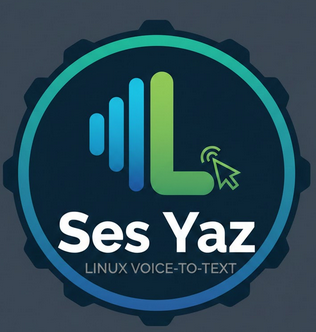

<div align="center">
  
  <h1>Sesyaz</h1>
  <p><strong>Sesle yaz — Linux için sesli dikte</strong></p>
  <p>
    Bir kısayola bas → konuş → metin panoya kopyalanır.<br/>
    OpenAI Whisper tabanlı transkripsiyon API'si ile çalışır.
  </p>
</div>

---

## Özellikler

- Minimal yüzen overlay bar (ChatGPT ses modu gibi)
- Kayıt sırasında canlı ses dalgası animasyonu
- **Duraklat / Devam et** desteği (⏸ butonu veya Space tuşu)
- Transkripsiyon sonrası anında panoya kopyalama
- İsteğe bağlı otomatik yapıştırma (xdotool)
- Güvenli API anahtarı depolama (sistem keyring / KWallet)
- Sıfır boşta bellek — her kullanımda yeni süreç başlar
- Yerleşik ayarlar paneli (⚙ ikonuna tıkla)

## Gereksinimler

- Linux + KDE Plasma + X11
- Python 3.11+
- OpenAI API anahtarı
- `xdotool` (otomatik yapıştırma için): `sudo apt install xdotool`

## Kurulum

```bash
git clone https://github.com/emirhann46/sesyaz.git
cd sesyaz
bash install.sh
```

Ardından KDE Özel Kısayol tanımla:
> Sistem Ayarları → Kısayollar → Özel Kısayollar → Yeni → Komut/URL
> **Komut:** `/path/to/sesyaz/.venv/bin/python -m sesyaz`

## Manuel Kurulum

**Herhangi bir shell:**
```bash
python3 -m venv .venv
.venv/bin/pip install -r requirements.txt
.venv/bin/python -m sesyaz
```

**Fish shell:**
```fish
python3 -m venv .venv
source .venv/bin/activate.fish
pip install -r requirements.txt
python3 -m sesyaz
```

## Kullanım

| İşlem | Nasıl |
|-------|-------|
| Kaydı başlat | KDE kısayoluyla başlat |
| Kaydı duraklat | ⏸ butonuna tıkla veya **Space** |
| Devam et | ▶ butonuna tıkla veya **Space** |
| Onayla ve transkribe et | ✔ butonuna tıkla |
| İptal et | ✕ butonuna tıkla veya **Esc** |
| Ayarları aç | ⚙ butonuna tıkla |

## Ayarlar

Overlay'deki ⚙ butonuna tıklayarak grafik ayarlar paneline ulaşabilirsin. Ya da `~/.config/sesyaz/config.json` dosyasını elle düzenleyebilirsin:

```json
{
  "model": "gpt-4o-mini-transcribe",
  "output_mode": "clipboard",
  "language": "tr",
  "stay_open": false,
  "position": "bottom"
}
```

| Anahtar | Varsayılan | Seçenekler |
|---------|-----------|-----------|
| `model` | `gpt-4o-mini-transcribe` | `gpt-4o-transcribe` |
| `output_mode` | `clipboard` | `paste`, `clipboard+paste` |
| `language` | *(otomatik)* | `tr`, `en`, `de`, `fr` … |
| `stay_open` | `false` | `true` — transkripsiyon sonrası metin düzenlenebilir |
| `position` | `bottom` | `top` |

## API Anahtarını Sıfırla

```bash
.venv/bin/python -c "from sesyaz.config.keyring_manager import KeyringManager; KeyringManager.delete_key()"
```

## Lisans

MIT
